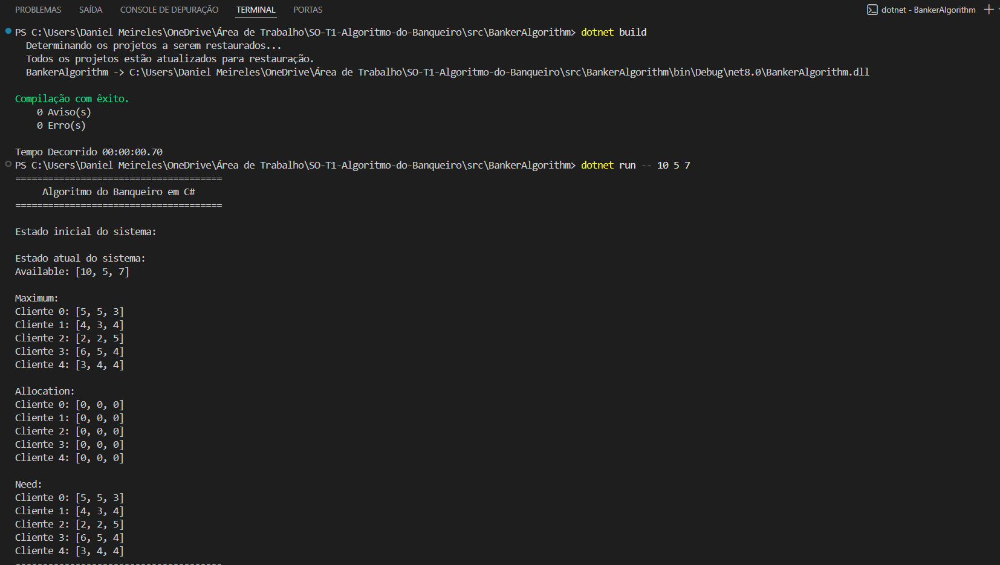
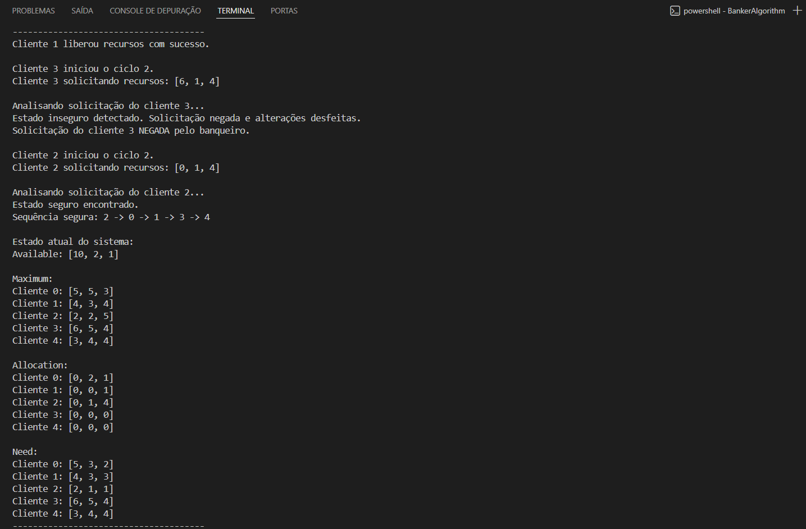
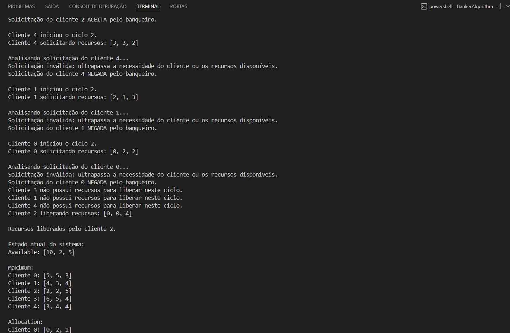
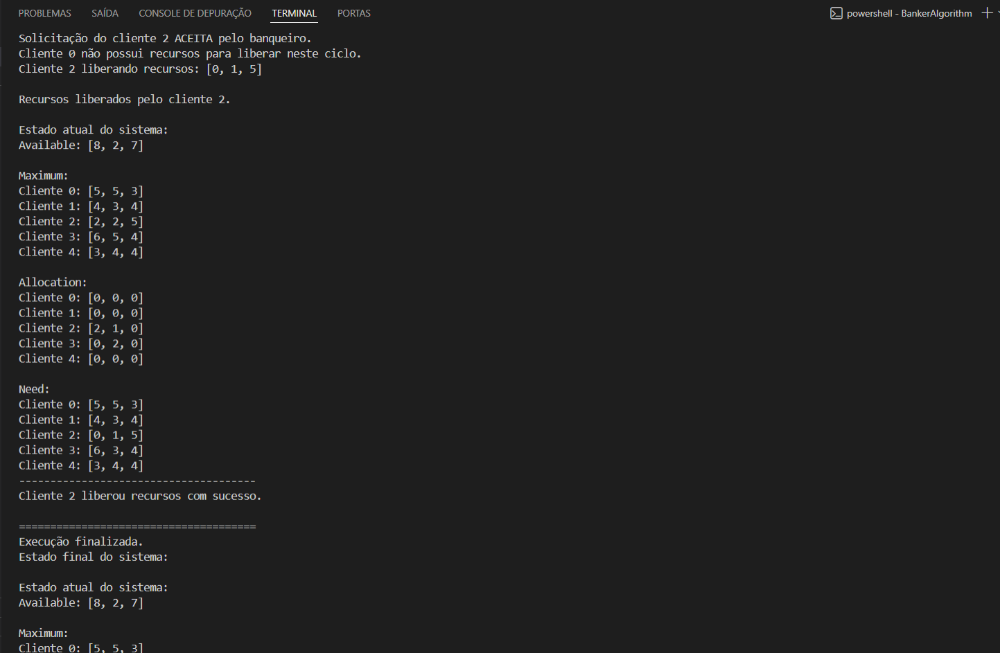

# Trabalho Prático 1 - Algoritmo do Banqueiro

Este repositório contém a implementação prática do **Algoritmo do Banqueiro** em C#.

O programa simula um banco de recursos compartilhados, no qual múltiplos clientes solicitam e liberam recursos concorrentemente. Cada cliente é representado por uma thread, e o banqueiro só concede uma solicitação caso ela mantenha o sistema em um estado seguro.

## Integrantes

- Daniel Meireles
- Marcus Mayer

## Objetivo

O objetivo deste trabalho é implementar uma solução multithread capaz de simular o funcionamento do Algoritmo do Banqueiro, abordando três conceitos principais:

- Criação e execução de múltiplas threads;
- Controle de acesso a dados compartilhados;
- Prevenção de deadlocks por meio da verificação de estados seguros.

## Sobre o Algoritmo do Banqueiro

O Algoritmo do Banqueiro é uma técnica de prevenção de deadlocks utilizada em sistemas operacionais. Antes de conceder recursos a um processo ou cliente, o algoritmo verifica se essa concessão mantém o sistema em um estado seguro.

Um estado é considerado seguro quando existe pelo menos uma sequência possível de execução em que todos os clientes conseguem terminar e liberar seus recursos.

Caso uma solicitação possa levar o sistema a um estado inseguro, ela é negada.

## Estruturas utilizadas

A implementação utiliza as principais estruturas do Algoritmo do Banqueiro:

- `available`: vetor que armazena a quantidade disponível de cada tipo de recurso;
- `maximum`: matriz que armazena a demanda máxima de cada cliente;
- `allocation`: matriz que armazena a quantidade de recursos atualmente alocada para cada cliente;
- `need`: matriz que armazena a necessidade restante de cada cliente.

A relação entre essas estruturas é:

```text
need = maximum - allocation
```

## Tecnologias utilizadas

- C#
- .NET
- Threads
- Lock para sincronização
- Aplicação Console

## Estrutura do projeto

```text
SO-T1-Algoritmo-do-Banqueiro/
├── screenshots/
├── src/
│   └── BankerAlgorithm/
│       ├── BankerAlgorithm.csproj
│       └── Program.cs
├── .gitignore
└── README.md
```

## Como compilar o projeto

Primeiro, acesse a pasta do projeto C#:

```bash
cd src/BankerAlgorithm
```

Depois, compile o projeto:

```bash
dotnet build
```

## Como executar o projeto

O programa deve ser executado informando, pela linha de comando, a quantidade disponível de cada tipo de recurso.

Exemplo:

```bash
dotnet run -- 10 5 7
```

Nesse exemplo, o sistema possui três tipos de recursos:

```text
Recurso 0: 10 unidades
Recurso 1: 5 unidades
Recurso 2: 7 unidades
```

O uso do `--` é necessário para separar os argumentos do comando `dotnet run` dos argumentos enviados para o programa.

## Observação sobre o loop dos clientes

### Modos de execução

O programa possui dois modos de execução.

### Modo com ciclos limitados

Esse modo limita a quantidade dos ciclos, então é bom para teste e vizualização.

```bash
dotnet run -- 10 5 7
```

### Modo contínuo

Este modo executa os clientes em loop contínuo e indefinido.

```bash
dotnet run -- 10 5 7 --continuous
```

Para interromper faça:

```text
Ctrl + C
```

## Funcionamento do programa

Ao ser executado, o programa realiza os seguintes passos:

1. Lê os recursos disponíveis informados na linha de comando;
2. Inicializa as matrizes `maximum`, `allocation` e `need`;
3. Cria cinco clientes, cada um representado por uma thread;
4. Cada cliente solicita recursos aleatoriamente;
5. O banqueiro verifica se a solicitação é válida;
6. O sistema simula a alocação dos recursos solicitados;
7. O algoritmo de segurança verifica se ainda existe uma sequência segura;
8. Se o estado for seguro, a solicitação é aceita;
9. Se o estado for inseguro, a solicitação é negada e a alocação simulada é desfeita;
10. Os clientes também liberam recursos durante a execução.

## Controle de concorrência

Como múltiplas threads acessam e modificam as mesmas estruturas compartilhadas, o programa utiliza `lock` para proteger as regiões críticas.

As principais estruturas protegidas são:

- `available`;
- `maximum`;
- `allocation`;
- `need`.

Esse controle evita condições de corrida e garante que apenas uma thread por vez altere o estado do banqueiro.

## Principais funções

### `RequestResources`

Função responsável por processar a solicitação de recursos de um cliente.

Ela verifica se:

- A solicitação não ultrapassa a necessidade restante do cliente;
- Existem recursos disponíveis;
- A concessão mantém o sistema em estado seguro.

Retorna:

```text
0  -> solicitação aceita
-1 -> solicitação negada
```

### `ReleaseResources`

Função responsável por liberar recursos previamente alocados a um cliente.

Ela verifica se o cliente realmente possui os recursos que está tentando liberar.

Retorna:

```text
0  -> liberação realizada com sucesso
-1 -> falha na liberação
```

### `IsSafeState`

Função responsável por executar o algoritmo de segurança.

Ela verifica se existe uma sequência segura em que todos os clientes podem finalizar sua execução.

## Exemplo de saída

Durante a execução, o programa exibe informações como:

```text
Cliente 1 solicitando recursos: [0, 1, 1]

Analisando solicitação do cliente 1...
Estado seguro encontrado.
Sequência segura: 1 -> 3 -> 0 -> 2 -> 4
Solicitação do cliente 1 ACEITA pelo banqueiro.
```

Também podem ocorrer solicitações negadas:

```text
Cliente 0 solicitando recursos: [3, 0, 1]

Analisando solicitação do cliente 0...
Estado inseguro detectado. Solicitação negada e alterações desfeitas.
Solicitação do cliente 0 NEGADA pelo banqueiro.
```

## Prints do Terminal

### Inicialização e Configuração do Sistema

O programa é executado via linha de comando, onde são informadas as instâncias totais de cada tipo de recurso disponível no banco.


> **Legenda:** Exemplo de inicialização com o comando `dotnet run -- 10 5 7`. O sistema configura o vetor `Available` e gera aleatoriamente a matriz `Maximum` para os 5 clientes, garantindo que nenhuma demanda máxima individual ultrapasse o total de recursos do sistema. Note que, no estado inicial, `Allocation` é zero e `Need` é igual a `Maximum`.

### Análise de Segurança e Prevenção de Deadlock

O coração do algoritmo: o banqueiro analisa se uma solicitação, mesmo que pareça viável pelos recursos disponíveis, pode levar o sistema a um travamento futuro.


> **Legenda:** Exemplo real de prevenção: o Cliente 3 faz uma solicitação que deixaria o sistema em um **Estado Inseguro**, resultando na negativa do banqueiro e no rollback das alocações. Logo em seguida, o Cliente 2 faz uma solicitação que permite uma **Sequência Segura** (`2 -> 0 -> 1 -> 3 -> 4`), sendo então aceita e processada.

### Validação de Requisições

Antes de realizar o teste de segurança, o Banqueiro verifica se a solicitação é consistente com os limites do sistema e a necessidade declarada pelo cliente.


> **Legenda:** Demonstração do tratamento de solicitações inválidas. O sistema impede que clientes (como os Clientes 4, 1 e 0 neste exemplo) solicitem recursos que ultrapassem sua necessidade restante (`Need`) ou que excedam o que está disponível no momento (`Available`). Também é possível observar a liberação de recursos pelo Cliente 2, aumentando a disponibilidade do banco.

### Finalização e Estado Final do Sistema

Após o cumprimento dos ciclos definidos para cada cliente, o programa encerra as threads de forma segura e exibe o balanço final dos recursos.


> **Legenda:** Encerramento da simulação. O log exibe a mensagem "Execução finalizada" seguida pelo estado final das estruturas. É possível verificar o saldo de recursos remanescentes no vetor `Available` e quais processos ainda mantinham alocações no momento do término.

## Conclusão

A implementação demonstra o funcionamento do Algoritmo do Banqueiro em um ambiente com múltiplas threads. O programa verifica cada solicitação antes de conceder recursos, evitando estados inseguros e reduzindo a possibilidade de deadlocks.

Além disso, o uso de `lock` garante que as estruturas compartilhadas sejam acessadas de forma segura, evitando condições de corrida.
